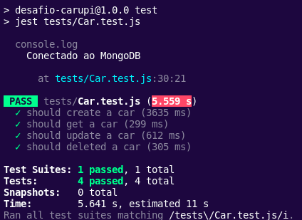

# Carupi - Desafio Técnico <h1>
Antes de tudo será necessario clonar o repositório, para isso basta rodar o seguinte comando:

~~~
git clone git@github.com:TainaIsabela/Desafio-Carupi
~~~

Após isso, será necessário instalar as depedências do projeto, portanto:

~~~
npm install
~~~

Prontinho! Agora basta rodar o arquivo de teste:

~~~
npm run test
~~~

Com isso você deve ver o seguinte log:

É possivel também testar a aplicação pelo insomnia, para isso foi disponibilizado um arquivo .json com os endpoints prontos para teste.

Para executar a aplicação:

~~~
npm run start
~~~

obs: no arquivo insomnia existem duas variaveis de ambiente muito parecidas, para que a Api funcione normalmente, ao rodar os testes utilize a 
variável ${BaseUrl}