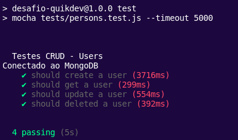

# QuickDev - Desafio Técnico <h1>
Antes de tudo será necessario clonar o repositório, para isso basta rodar o seguinte comando:

~~~
git clone git@github.com:TainaIsabela/Desafio-Quickdev
~~~

Após isso, será necessário instalar as depedências do projeto, portanto:

~~~
npm install
~~~

Prontinho! Agora basta rodar o arquivo de teste:

~~~
npm test
~~~

Com isso você deve ver o seguinte log:

É possivel também testar a aplicação pelo postman, para isso foi disponibilizado um arquivo .json com os endpoints prontos para teste.